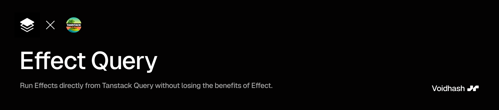

<p align="center">
    
</p>

# Effect Query

<a href="https://www.npmjs.com/package/effect-query" target="\_parent">
  
</a>
 <a href="https://github.com/voidhashcom/effect-query/" target="\_parent">
  
</a>

Integration of Effect-ts with Tanstack Query. Run your Effects from Tanstack Query. Fully type-safe and compatible with Effect RPC and Effect HttpApi.

## Quick Start

```bash
# Install the package
npm install effect-query

# Install peer dependencies (if not already installed)
npm install @tanstack/react-query effect

```

# Initialize

```ts
// src/utils/effect-query.ts
import { createEffectQuery } from "effect-query";
import { Layer } from "effect";

export const eq = createEffectQuery(Layer.empty);

// Alternative: Create from effect-query from ManagedRuntime instead of Layer
import { createEffectQueryFromManagedRuntime } from "effect-query";
import { Layer, ManagedRuntime } from "effect";

const managedRuntime = ManagedRuntime.make(Layer.empty);
export const eq = createEffectQueryFromManagedRuntime(managedRuntime);
```

# Query Example

```tsx
// src/pages/example.tsx
import { useQuery } from "@tanstack/react-query";
import { Effect } from "effect";
import { eq } from "./effect-query";

export const eq = createEffectQuery(Layer.empty);
export default function HomeRoute() {
  const { data, status } = useQuery(
    eq.queryOptions({
      queryKey: ["namespace", "action"],
      queryFn: () => Effect.succeed("Hello, world!"),
    })
  );

  return (
    <div>
      {status === "pending" && <div>Loading...</div>}
      {status === "success" && <div>{data}</div>}
    </div>
  );
}
```

# Mutation Example

```tsx
// src/pages/users.tsx
import { eq } from "./effectQuery";
import { useMutation } from "@tanstack/react-query";

// You can move this outside of the component and even share it with other components
const updateUserOptions = eq.mutationOptions({
  mutationKey: "updateUserOptions"
  mutationFn: () => Effect.gen(function* () {
    const user = yield* Effect.sleep(1000);
    yield* Console.log("Updating user...");
    return Effect.succeed("User updated");
  }),
});

function UpdateUserPage({ id }: { id: string }) {
  const { mutate } = useMutation(updateUserOptions);
  return <button onClick={() => mutate({ id })}>Update User</button>;
}
```

# Error Handling

When your Effect fails, the error object includes a `match` function that lets you handle different error types in a type-safe manner. When using match, the `OrElse` case is used as a catch-all for all the remaining unhandled failures and for defects. We are not able to fully check if defects can occur and therefore `OrElse` is required.

```tsx
function Examle() {
  const { data, status, error } = useQuery({
    /** ... */
  });

  if (status === "error" && error) {
    return error.match({
      QueryError: (queryError) => <div>Query error: {queryError.hello}</div>,
      TestError: (testError) => <div>Test error: {testError.message}</div>,
      OrElse: (cause) => <div>Error: {Cause.pretty(cause)}</div>,
    });
  }
}
```

Match can be also used to handle errors during mutations.

## Mutation Error Handling

The same pattern works for mutations, allowing you to handle errors in callbacks:

```tsx
export default function UpdateUserPage({ id }: { id: string }) {
  const { mutate } = useMutation({
    /*...*/
    onError: (error) =>
      error.match({
        UserUpdateError: (userUpdateError) => {
          alert(`${userUpdateError.message}`);
        },
        OrElse: (cause) => {
          alert(`Error updating user: ${Cause.pretty(cause)}`);
        },
      }),
  });
}
```

# Usage with Effect HttpApi

```ts
// src/utils/effect-query.ts
import { createEffectQuery } from "effect-query";
import { Layer } from "effect";
import { HttpApiClient } from "@effect/http-api";
import { HttpApiSpec } from "./http-api-spec";

// Create your ApiClient service
export class ApiClient extends Effect.Service<ApiClient>()(
  'example/ApiClient',
  {
    dependencies: [],
    effect: HttpApiClient.make(HttpApiSpec, {
      baseUrl: "https://api.example.com"
    });
  }
) {}

// Create a final layer for your Effect Query
export const LiveLayer = Layer.mergeAll(ApiClient.Default);

export const eq = createEffectQuery(LiveLayer);

// Use it in your components
export default function HomeRoute() {
  const { data, status, error } = useQuery(
    eq.queryOptions({
      queryKey: ["example", "hello-world"],
      queryFn: () => Effect.gen(function* () {
        const apiClient = yield* ApiClient;
        return yield* apiClient.hello.helloWorld({ /* ... */ });
      }),
    })
  );
}


```

# Usage with Effect RPC

```ts
// src/utils/effect-query.ts
import { createEffectQuery } from "effect-query";
import { Layer } from "effect";
import { FetchHttpClient } from "@effect/platform";
import { RpcClient, RpcSerialization } from "@effect/rpc";

const API_DOMAIN = "https://api.example.com";

// Create RpcProtocol layer for your RPC client
export const RpcProtocolLive = RpcClient.layerProtocolHttp({
  url: `${API_DOMAIN}/rpc`,
}).pipe(
  Layer.provide([
    // use fetch for http requests
    FetchHttpClient.layer
    // use ndjson for serialization
    RpcSerialization.layerNdjson,
  ])
);

// Create your ApiClient service
export class MyRpcClient extends Effect.Service<MyRpcClient>()(
  'example/MyRpcClient',
  {
    dependencies: [],
    scoped: RpcClient.make(RpcGroups)
  }
) {}

// Create a final layer for your Effect Query
export const LiveLayer = MyRpcClient.Default.pipe(
  Layer.provideMerge(RpcProtocolLive)
);

export const eq = createEffectQuery(LiveLayer);

// Use it in your components
export default function HomeRoute() {
  const { data, status, error } = useQuery(
    eq.queryOptions({
      queryKey: ["example", "hello-world"],
      queryFn: () => Effect.gen(function* () {
        const rpcClient = yield* MyRpcClient;
        return yield* rpcClient.HelloWorld()
      }),
    })
  );
}
```

---

<p align="center">
  Made with ❤️ by <a href="https://voidhash.com">Voidhash</a>
</p>
