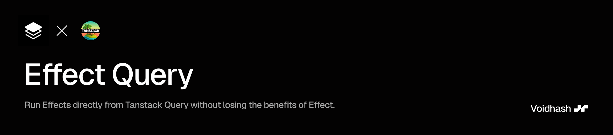

<p align="center">
    
</p>

# Effect Query

<a href="https://www.npmjs.com/package/effect-query" target="\_parent">
  
</a>
 <a href="https://github.com/voidhashcom/effect-query/" target="\_parent">
  
</a>

Integration of Effect-ts with Tanstack Query. Run your Effects from Tanstack Query. Fully type-safe and compatible with Effect RPC and Effect HttpApi.

## Quick Start

```bash
# Install the package
npm install effect-query

# Install peer dependencies (if not already installed)
npm install @tanstack/react-query effect

```

> Vue, Solid and Svelte support (and the type inference improvements described below) ship in the `2.0.0` prerelease: `npm install effect-query@alpha`.

## Framework support

`effect-query` works with every TanStack Query adapter. Import from the entry point matching your framework:

| Framework | Entry point                               | TanStack Query package  |
| --------- | ----------------------------------------- | ----------------------- |
| React     | `effect-query` (or `effect-query/react`)  | `@tanstack/react-query` |
| Vue       | `effect-query/vue`                        | `@tanstack/vue-query`   |
| Solid     | `effect-query/solid`                      | `@tanstack/solid-query` |
| Svelte    | `effect-query/svelte`                     | `@tanstack/svelte-query` (v6, Svelte 5 runes) |

Every adapter exposes the same `createEffectQuery` / `createEffectQueryFromManagedRuntime` API and returns plain TanStack Query options. The success type of your Effect becomes `data`, and its failure channel becomes the `error` type (`EffectQueryFailure<E> | EffectQueryDefect<unknown>`), so both are inferred end to end in `useQuery`, `useSuspenseQuery`, `useInfiniteQuery`, `useMutation`, `useQueries` and on the `QueryClient` (`getQueryData`, `fetchQuery`, ...).

## Vue

```ts
// src/effect-query.ts
import { createEffectQuery } from "effect-query/vue";
export const eq = createEffectQuery(GreetingApiLive);
```

```vue
<script setup lang="ts">
import { useQuery } from "@tanstack/vue-query";
import { Cause, Effect } from "effect";
import { computed, ref } from "vue";
import { eq, GreetingApi } from "./effect-query";

const name = ref("world");

// Pass a getter so the options are recomputed when `name` changes.
// data: Ref<string | undefined>, error: Ref<EffectQueryFailure<...> | EffectQueryDefect<unknown> | null>
const { data, error } = useQuery(() =>
  eq.queryOptions({
    queryKey: ["greeting", name.value],
    queryFn: () =>
      Effect.gen(function* () {
        const greetingApi = yield* GreetingApi;
        const greeting = yield* greetingApi.loadGreeting();
        return `${greeting} (${name.value})`;
      }),
  })
);

// Add a handler per failure tag of your Effect, `OrElse` handles the rest.
const errorMessage = computed(() =>
  error.value?.match({ OrElse: (cause) => Cause.pretty(cause) })
);
</script>
```

> Like vue-query's own `queryOptions`, refs can be used inside `queryKey`, `enabled`, `staleTime`, etc. and are unwrapped in the `queryFn` context. However, TypeScript < 7 cannot infer `useQuery(options)` when the `queryKey` *returned by `queryOptions`* contains a ref, so prefer the getter form shown above.

See [`examples/vue-example`](./examples/vue-example) for queries, mutations, infinite queries and Effect RPC.

## Solid

```tsx
import { useQuery } from "@tanstack/solid-query";
import { Cause, Effect } from "effect";
import { createEffectQuery } from "effect-query/solid";
import { createSignal, Show } from "solid-js";

const eq = createEffectQuery(GreetingApiLive);

function Greeting() {
  const [name, setName] = createSignal("world");

  // query.data: string | undefined
  // query.error: EffectQueryFailure<...> | EffectQueryDefect<unknown> | null
  const query = useQuery(() =>
    eq.queryOptions({
      queryKey: ["greeting", name()],
      queryFn: () =>
        Effect.gen(function* () {
          const greetingApi = yield* GreetingApi;
          const greeting = yield* greetingApi.loadGreeting();
          return `${greeting} (${name()})`;
        }),
    })
  );

  return (
    <Show when={query.error} fallback={<p>{query.data}</p>}>
      {(error) => <p>{error().match({ OrElse: (cause) => Cause.pretty(cause) })}</p>}
    </Show>
  );
}
```

As with solid-query, options are passed through an accessor (`useQuery(() => eq.queryOptions(...))`). `data` stays correctly typed even when the options are created inline.

See [`examples/solid-example`](./examples/solid-example) for queries, mutations, infinite queries and Effect RPC.

## Svelte

```svelte
<script lang="ts">
  import { createQuery } from "@tanstack/svelte-query";
  import { Cause, Effect } from "effect";
  import { createEffectQuery } from "effect-query/svelte";

  const eq = createEffectQuery(GreetingApiLive);

  let name = $state("world");

  // query.data: string | undefined
  // query.error: EffectQueryFailure<...> | EffectQueryDefect<unknown> | null
  const query = createQuery(() =>
    eq.queryOptions({
      queryKey: ["greeting", name],
      queryFn: () =>
        Effect.gen(function* () {
          const greetingApi = yield* GreetingApi;
          const greeting = yield* greetingApi.loadGreeting();
          return `${greeting} (${name})`;
        }),
    })
  );

  const errorMessage = $derived(
    query.error?.match({ OrElse: (cause) => Cause.pretty(cause) })
  );
</script>

<input bind:value={name} />
{#if errorMessage}<p>{errorMessage}</p>{:else}<p>{query.data}</p>{/if}
```

`effect-query/svelte` targets `@tanstack/svelte-query` v6 (Svelte 5 runes), where options are passed through an accessor.

See [`examples/svelte-example`](./examples/svelte-example) for queries, mutations, infinite queries and Effect RPC.

# Initialize

```tsx
// src/utils/effect-query.ts
import { useQuery } from "@tanstack/react-query";
import { createEffectQuery } from "effect-query";
import { Context, Effect, Layer, ManagedRuntime } from "effect";

export class GreetingApi extends Context.Service<
  GreetingApi,
  {
    readonly loadGreeting: () => Effect.Effect<string>;
  }
>()("example/GreetingApi") {}

const GreetingApiLive = Layer.succeed(GreetingApi)({
  loadGreeting: () => Effect.succeed("Hello, world!"),
});

export const eq = createEffectQuery(GreetingApiLive);

// Alternative: Create from effect-query from ManagedRuntime instead of Layer
import { createEffectQueryFromManagedRuntime } from "effect-query";

const runtime = ManagedRuntime.make(GreetingApiLive);
export const eqFromRuntime = createEffectQueryFromManagedRuntime(runtime);
```

## Runtime lifecycle

`createEffectQuery(layer)` builds the layer lazily, once, on the first query and shares it between every query and mutation. Each factory also exposes the runtime:

```ts
// Run an Effect outside of a query, e.g. in a router loader.
await eq.runtime.runPromise(effect);

// Run the finalizers of the scoped services of the layer (sockets, RPC clients, fibers...).
await eq.dispose();
```

- **Dispose when you are done with it.** Call `dispose()` when the factories are no longer used. Typical cases are an HMR update (`import.meta.hot?.dispose(() => eq.dispose())`) or the end of a server request when the factories are created per request. Queries that start after `dispose()` fail with an `EffectQueryDefect`.
- **A failed layer build is retried.** If building the layer dies (e.g. a transient network error while acquiring a resource), the failed runtime is discarded. The next query builds the layer again, so TanStack Query's retries can recover.
- **A runtime you pass in is never replaced.** `createEffectQueryFromManagedRuntime` keeps the runtime you passed in as it is, and `dispose()` disposes it.
- **Create the factories per request on the server.** A factory created at module level shares one runtime between every request.

# Query Example

```tsx
// src/pages/example.tsx
import { useQuery } from "@tanstack/react-query";
import { Effect } from "effect";
import { GreetingApi, eq } from "./effect-query";

export default function HomeRoute() {
  const { data, status } = useQuery(
    eq.queryOptions({
      queryKey: ["namespace", "action"],
      queryFn: () =>
        Effect.gen(function* () {
          const greetingApi = yield* GreetingApi;
          return yield* greetingApi.loadGreeting();
        }),
    })
  );

  return (
    <div>
      {status === "pending" && <div>Loading...</div>}
      {status === "success" && <div>{data}</div>}
    </div>
  );
}
```

# Mutation Example

```tsx
// src/pages/users.tsx
import { createEffectQueryFromManagedRuntime } from "effect-query";
import { useMutation } from "@tanstack/react-query";
import {
  Console,
  Context,
  Data,
  Duration,
  Effect,
  Layer,
  ManagedRuntime,
} from "effect";

class UserUpdateError extends Data.TaggedError("UserUpdateError")<{
  message: string;
}> {}

class UserApi extends Context.Service<
  UserApi,
  {
    readonly updateUser: (id: string) => Effect.Effect<string, UserUpdateError>;
  }
>()("example/UserApi") {}

const UserApiLive = Layer.succeed(UserApi)({
  updateUser: (id: string) =>
    Effect.gen(function* () {
      yield* Effect.sleep(Duration.millis(1000));
      yield* Console.log(`Updating user ${id}...`);
      return "User updated";
    }),
});

const runtime = ManagedRuntime.make(UserApiLive);
export const eq = createEffectQueryFromManagedRuntime(runtime);

// You can move this outside of the component and even share it with other components
const updateUserOptions = eq.mutationOptions({
  mutationKey: ["updateUserOptions"],
  mutationFn: (variables: { id: string }) =>
    Effect.gen(function* () {
      const userApi = yield* UserApi;
      return yield* userApi.updateUser(variables.id);
    }),
});

function UpdateUserPage({ id }: { id: string }) {
  const { mutate } = useMutation(updateUserOptions);
  return <button onClick={() => mutate({ id })}>Update User</button>;
}
```

# Error Handling

When your Effect fails, the error object includes a `match` function that lets you handle different error types in a type-safe manner. When using match, the `OrElse` case is used as a catch-all for all the remaining unhandled failures and for defects. We are not able to fully check if defects can occur and therefore `OrElse` is required.

```tsx
function Example() {
  const { data, status, error } = useQuery({
    /** ... */
  });

  if (status === "error" && error) {
    return error.match({
      QueryError: (queryError) => <div>Query error: {queryError.hello}</div>,
      TestError: (testError) => <div>Test error: {testError.message}</div>,
      OrElse: (cause) => <div>Error: {Cause.pretty(cause)}</div>,
    });
  }
}
```

Match can be also used to handle errors during mutations.

`EffectQueryFailure` and `EffectQueryDefect` are exported as classes, so you can also narrow with `instanceof`:

```tsx
import { EffectQueryFailure } from "effect-query";

if (error instanceof EffectQueryFailure) {
  error.failure; // QueryError | TestError
}
```

| | `EffectQueryFailure` | `EffectQueryDefect` |
| --- | --- | --- |
| When | The Effect failed with a typed failure | The Effect died, or was interrupted |
| `name` / `_tag` | `"EffectQueryFailure"` | `"EffectQueryDefect"` |
| `message` | Short summary (the failure's `message` or `_tag`), safe to show in a UI | Short summary of the defect |
| `cause` (standard `Error` property) | The failure | The defect |
| Payload | `failure`: the first failure, `failureCause`: the full `Cause` | `defect`: the value passed to `Effect.die` or the exception thrown, `defectCause`: the full `Cause`, `interrupted`: `true` if the Effect was interrupted rather than dying |

Use `Cause.pretty(error.failureCause)` or `Cause.pretty(error.defectCause)` for a full, multi-line report including stack traces. Only show it in development, never in a UI.

If an Effect function throws instead of returning an Effect, the exception becomes an `EffectQueryDefect` too.

These errors are class instances and do not survive serialization (`structuredClone`, `JSON`, or SSR payloads): after a round trip, `match`, `failure` and `instanceof` are gone. TanStack Query does not dehydrate failed queries by default, so this only matters if you opt into it with `shouldDehydrateQuery`. In that case, map errors to plain data before they cross the boundary.

## Cancellation and logging

- **Cancelling interrupts the Effect.** Every query runs its Effect with TanStack Query's `AbortSignal`, so when a query is cancelled the Effect is interrupted and its finalizers run. A query is cancelled by `queryClient.cancelQueries`, or when its last observer unmounts while it is still fetching. When the last observer unmounts mid-fetch, the query goes back to its previous state rather than finishing in the background.
- **Only defects are logged.** Defects are logged at the `Error` level through the logger of your runtime, so provide a `Logger` layer to route or silence them. Typed failures are expected and reach you through TanStack Query, so they are not logged. Interruptions are not logged either.
- **Spans are named after the key.** Each query and mutation runs in a span named after the first element of its `queryKey` / `mutationKey`.

## Mutation Error Handling

The same pattern works for mutations, allowing you to handle errors in callbacks:

```tsx
export default function UpdateUserPage({ id }: { id: string }) {
  const { mutate } = useMutation({
    /*...*/
    onError: (error) =>
      error.match({
        UserUpdateError: (userUpdateError) => {
          alert(`${userUpdateError.message}`);
        },
        OrElse: (cause) => {
          alert(`Error updating user: ${Cause.pretty(cause)}`);
        },
      }),
  });
}
```

## Suspense Error Handling

With `useSuspenseQuery` (or `throwOnError`) errors are thrown to the nearest error boundary, where their type is lost. `QueryErrorBoundary` is bound to the query options it guards, so its `fallback` receives the same typed error as `useQuery` would:

```tsx
import { QueryErrorBoundary } from "effect-query";

function UserPage({ id }: { id: string }) {
  return (
    <QueryErrorBoundary
      query={userOptions(id)} // or several: query={[userOptions(id), postsOptions(id)]}
      fallback={({ error, reset }) =>
        error.match({
          NotFound: (notFound) => <p>User {notFound.id} does not exist</p>,
          OrElse: () => <button onClick={reset}>Retry</button>,
        })
      }
    >
      <Suspense fallback={<Spinner />}>
        <UserProfile id={id} /> {/* useSuspenseQuery(userOptions(id)) */}
      </Suspense>
    </QueryErrorBoundary>
  );
}
```

- Only errors produced by the given queries are handled. Anything else is rethrown to the next error boundary up the tree, so the `fallback` type is always accurate.
- `reset` refetches the failed queries (it uses TanStack Query's `QueryErrorResetBoundary`).
- The boundary resets on its own when the `queryKey` of `query` changes, e.g. when navigating between ids. Each query is hashed with its own `queryKeyHashFn`, so keys that need a custom hash (e.g. containing a `BigInt`) work.
- With Solid SSR, a boundary that rendered its fallback on the server keeps it while hydrating. Its `fallback` then receives the typed error from the client's cache if there is one, otherwise an `EffectQueryDefect` wrapping the deserialized server error (`error.defect`).

`QueryErrorBoundary` is also exported from `effect-query/solid` (wraps Solid's `ErrorBoundary`, set `throwOnError: true` on the queries) and `effect-query/vue` (uses `onErrorCaptured`; the error is passed to the `#fallback="{ error, reset }"` slot; set `throwOnError: true` so `await query.suspense()` rejects).

For error boundaries you don't own (a router's error component, Svelte's `<svelte:boundary>`, ...), every entry point exports the underlying guard:

```ts
import { isQueryError } from "effect-query";

if (isQueryError(queryClient, userOptions(id), error)) {
  error; // EffectQueryFailure<NotFound> | EffectQueryDefect<unknown>
}
```

# Usage with Effect HttpApi

```tsx
// src/utils/effect-query.ts
import { useQuery } from "@tanstack/react-query";
import { createEffectQuery } from "effect-query";
import { Context, Effect, Layer } from "effect";
import { FetchHttpClient } from "effect/http";
import { HttpApiClient } from "effect/http-api";
import { HttpApiSpec } from "./http-api-spec";

// Create your ApiClient service
export class ApiClient extends Context.Service<
  ApiClient,
  HttpApiClient.ForApi<typeof HttpApiSpec>
>()("example/ApiClient", {
  make: HttpApiClient.make(HttpApiSpec, {
    baseUrl: "https://api.example.com",
  }),
}) {}

// Create a final layer for your Effect Query
export const LiveLayer = Layer.effect(ApiClient)(ApiClient.make).pipe(
  Layer.provide(FetchHttpClient.layer)
);

export const eq = createEffectQuery(LiveLayer);

// Use it in your components
export default function HomeRoute() {
  const { data, status, error } = useQuery(
    eq.queryOptions({
      queryKey: ["example", "hello-world"],
      queryFn: () =>
        Effect.gen(function* () {
          const apiClient = yield* ApiClient;
          return yield* apiClient.hello.helloWorld({
            /* ... */
          });
        }),
    })
  );
}
```

# Usage with Effect RPC

```tsx
// src/utils/effect-query.ts
import { useQuery } from "@tanstack/react-query";
import { createEffectQuery } from "effect-query";
import { Context, Effect, Layer } from "effect";
import { FetchHttpClient } from "effect/http";
import { RpcClient, RpcSerialization } from "effect/rpc";
import { RpcGroups } from "./rpc-schema";

const API_DOMAIN = "https://api.example.com";

// Create RpcProtocol layer for your RPC client
export const RpcProtocolLive = RpcClient.layerProtocolHttp({
  url: `${API_DOMAIN}/rpc`,
}).pipe(
  Layer.provideMerge(
    Layer.mergeAll(FetchHttpClient.layer, RpcSerialization.layerNdjson)
  )
);

// Create your ApiClient service
export class MyRpcClient extends Context.Service<MyRpcClient>()(
  "example/MyRpcClient",
  {
    make: RpcClient.make(RpcGroups),
  }
) {}

// Create a final layer for your Effect Query
export const LiveLayer = Layer.effect(MyRpcClient)(MyRpcClient.make).pipe(
  Layer.provide(RpcProtocolLive)
);

export const eq = createEffectQuery(LiveLayer);

// Use it in your components
export default function HomeRoute() {
  const { data, status, error } = useQuery(
    eq.queryOptions({
      queryKey: ["example", "hello-world"],
      queryFn: () => Effect.gen(function* () {
        const rpcClient = yield* MyRpcClient;
        return yield* rpcClient.HelloWorld();
      }),
    })
  );
}
```

# Mutation with Effect RPC

```tsx
// src/pages/users.tsx
import { useMutation } from "@tanstack/react-query";
import { Cause, Effect } from "effect";
import { MyRpcClient, eq } from "./effect-query";

export default function UpdateUserPage() {
  const { mutate } = useMutation(
    eq.mutationOptions({
      mutationKey: ["example", "rename-user"],
      mutationFn: (variables: { id: string; name: string }) =>
        Effect.gen(function* () {
          const rpcClient = yield* MyRpcClient;
          return yield* rpcClient.RenameUser(variables);
        }),
      onError: (error) =>
        error.match({
          RenameUserError: (renameUserError) => {
            alert(renameUserError.message);
          },
          OrElse: (cause) => {
            alert(`Error updating user: ${Cause.pretty(cause)}`);
          },
        }),
    })
  );

  return (
    <button onClick={() => mutate({ id: "user-123", name: "Ripley" })}>
      Rename User
    </button>
  );
}
```

---

<p align="center">
  Made with ❤️ by <a href="https://voidhash.com">Voidhash</a>
</p>
